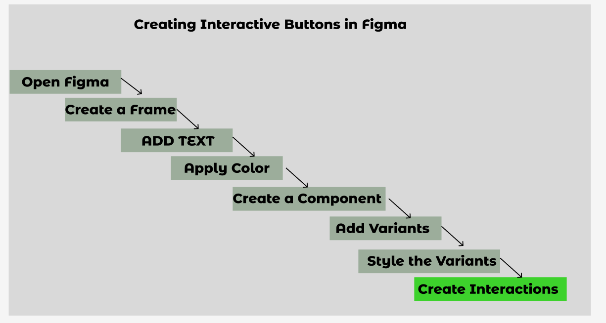

### Step-by-Step Guide to Create Button with Hover and Click Effects

**Step 1:** Open Figma
- Open Figma in your browser or desktop application.

**Step 2:** Create a Frame
- Select the Frame tool by pressing `F`.
- Draw a simple frame and adjust the size as needed.
- Apply a border radius to your frame for rounded corners.

**Step 3:** Add Text
- Select the Text tool by pressing `T`.
- Click inside the frame and type the button text (e.g., "Click Me").

**Step 4:** Apply Color
- Select your frame and apply the desired background color.
- Select your text and apply the desired text color.

**Step 5:** Create a Component
- Select both the frame and text.
- Use the shortcut `Ctrl + Alt + K` (Windows) or `Cmd + Option + K` (Mac) to create a component.

**Step 6:** Add Variants
- Select your main button component.
- Click on the '+' icon in the right panel under 'Variants' to create variants for hover and click states.
- Name the variants (e.g., Default, Hover, Click).

**Step 7:** Style the Variants
- Adjust the properties for each variant:
  - Default: The original button style.
  - Hover: Change the fill color or add a shadow.
  - Click: Change the background or text color.

**Step 8:** Create Interactions
- Select the Default variant.
- Go to the Prototype tab.
- Add an interaction from the Default variant to the Hover variant:
  - Trigger: While hovering
  - Action: Change to Hover variant
- Add another interaction from the Hover variant to the Click variant:
  - Trigger: On click
  - Action: Change to Click variant

